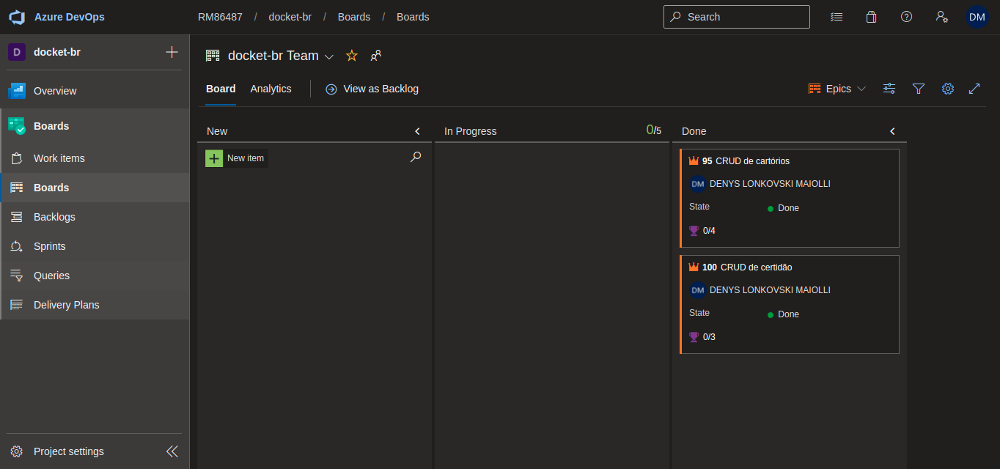
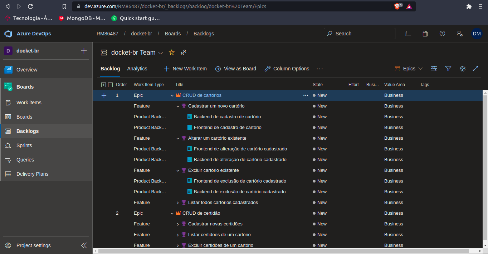

<h3 align="center">
    

      <a href="#-tecnologias">Tecnologias</a>&nbsp;&nbsp;&nbsp;|&nbsp;&nbsp;&nbsp;
  

</h3>

   

## 🔖 Sobre

O <strong>cartorio-spring</strong> é uma aplicação desenvolvida durante um teste técnico de software, para vaga de backend em Java!
## 🚀 Tecnologias

Esse projeto foi desenvolvido com as seguintes tecnologias:

- [SpringBoot](https://spring.io/projects/spring-boot)
- [Thymeleaf](https://www.thymeleaf.org/)
- [PostgreSQL](https://www.postgresql.org)
- [Hibernate](https://hibernate.org/)

## Documentação
  <h1>Azure Boards</h1>
  
O azure boards foi utilizado para transformar a história do usuário em épicos/features e backlogs, para uma maior organização e gerenciamento de tarefas na metodologia SCRUM

  
  

  <h1>MER - Modelo relacional</h1>
  
O MER foi desenvolvido para definir a modelagem de entidade e relacionamento na ferramenta Oracle Datamodeler

  
  
<h4 align="center">
    Feito com 💜 by <a href="https://www.linkedin.com/in/dmaiolli/" target="_blank">Denys Maiolli</a>
</h4>
